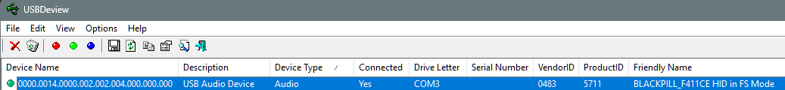
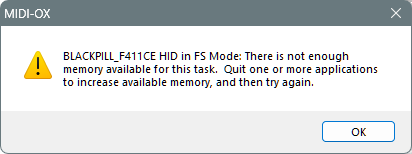

# [MIDI echo example](MIDIecho.ino)
echo MIDI in to out
*handling* `MIDI.read()` *in a* `loop()`  

USBDeview shows <code>COM3</code> "Drive Letter" while only MIDI is configured...
  
[USB Device Tree View report](UDBdevTreeView.txt) 

MIDI Output rarely works and only when connected to the same software as Input...
- Cannot read from <code>BLACKPILL_F411CE HID in FS Mode</code> in e.g. [MidiView](https://hautetechnique.com/midi/midiview/)

Faster LED flash rate for 4 seconds after activity.

Cannot write to <code>BLACKPILL_F411CE HID in FS Mode</code> from e.g. [MIDI-OX](http://www.midiox.com/)  
when connected to read from the device with e.g. [MidiView](https://hautetechnique.com/midi/midiview/);  
MIDI-OX pops up:  
  

Must reopen devices in MIDI-OX after resetting/reloading Black Pill.

## Composite MIDI + CDC fails
Just instancing `USBSerial.begin(115200);` is enough to kill all Black Pill USB...  
Windows 11 is unhappy enough that DFU subsequently fails;  must use ST-Link.

### MIDI + HardwareSerial
<code>HardwareSerial USBSerial(PA3, PA2);</code> instead of <code>USBCDC USBSerial;</code>
<ul><li><code>MidiUSB.available()</code> appears to never return non-zero.
<li>MIDI-OX sees CCs echoed (by MIDIecho) when MIDIecho <code>MidiUSB.read()</code>s them...!
<li>only <code>sendMIDI</code> packets (CCs) immediately after <code>read()</code> are seen by MIDI-OX
<li><code>MidiUSB.flush()</code> seems not useful..?
</ul>
