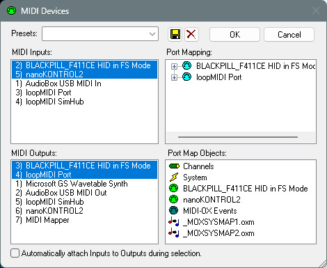
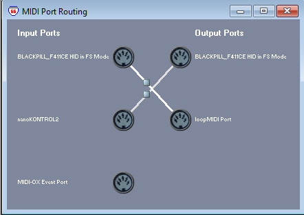

# [MIDI echo example](MIDIecho.ino)
 &emsp; *for testing* [USBLibrarySTM32](https://blekenbleu.github.io/static/USBLibrarySTM32/)

echo MIDI in to out
*handling* `MIDI.read()` *in a* `loop()`  
Faster LED flash rate for 4 seconds after activity.  

### Cannot simultaneously write from one Windows MIDI app and read from from another
Cannot write to `BLACKPILL_F411CE HID in FS Mode` from e.g. [MIDI-OX](http://www.midiox.com/)  
when connected to read from `BLACKPILL_F411CE HID in FS Mode` with e.g. [MidiView](https://hautetechnique.com/midi/midiview/);  
MIDI-OX pops up:  
  

Workaround:&nbsp; test both reading and writing via [MIDI-OX](http://www.midiox.com/):
- MIDI-OX Options > Devices  

- MIDI-OX View > Port Routings...  
    
	- route nanoKONTROL2 CCs to Black Pill
	- route Black Pill to [loopMIDI](https://www.tobias-erichsen.de/software/loopmidi.html),
	which feeds [MidiView](https://hautetechnique.com/midi/midiview/)  
- Restart MIDI-OX after resetting/reloading Black Pill.

[USBDeview](https://www.nirsoft.net/utils/usb_devices_view.html) shows `COM3` "Drive Letter"
	 while sketch configures only USB MIDI...
  
[USB Device Tree View report](UDBdevTreeView.txt) 

**`MidiUSB.sendMIDI()` works *only* during `MidiUSB.read()` with non-0 `rx.header`**  

## Composite MIDI + CDC fails
Merely instancing `USBCDC USBserial;` with `MidiUSB.available();` suffices to kill Black Pill USB...  
*Workaround*:&nbsp; use `HardwareSerial` instead of `USBCDC` to sort MIDI.

### MIDI + HardwareSerial
`HardwareSerial USBSerial(PA3, PA2);` instead of `USBCDC USBSerial;`
- `MidiUSB.available()` appears to never return non-zero.
- `MidiUSB.flush()` seemingly no effect..?
- `sendMIDI()` [CC] packets <b>are seen only during</b> `MidiUSB.read()`
	- Channel 1 are CCs from MIDI control surface, routed thru MIDI-OX to Black Pill
    - Channel 2 are sketch-generated CCs *immediately after* every 8th input CC
	- Channel 3 are sketch-generated CCs *after* `delay()` for every 8th input CC
	- Channel 4 are sketch-generated CCs *50 msec after every* input CC
		- these are **only** seen when Channel 3 delay is *more than 50 msec*,  
         presumably because `delay()` also delayed `MidiUSB.read()` processing...
    - Channel 5 are sketch-generated CCs every 10 seconds, but are **not seen**.

### MIDIecho serial terminal control
`MIDIecho.ino` *always* writes a Channel 4 CC 100 milliseconds after most recent `MidiUSB.read()`;  
`do_echo()` writes `count` Channel 2 CCs immediately after every 8th `MidiUSB.read()`,  
 &emsp; then another `count` Channel 3 CCs after `delay(later)`  
- `do_echo()` *with long enough* 'delay(later)` enables Channel 4 CC..   

**MIDIecho serial terminal (NUM pad) Keystroke handling:**
- [space] toggles echo
- [2] toggles `MidiUSB.flush()`  
- [+] increases later 10 msec
- [-] decreases later 8 msec
- [0] sets later = 0
- [.] decrements count
- [1] increments count

